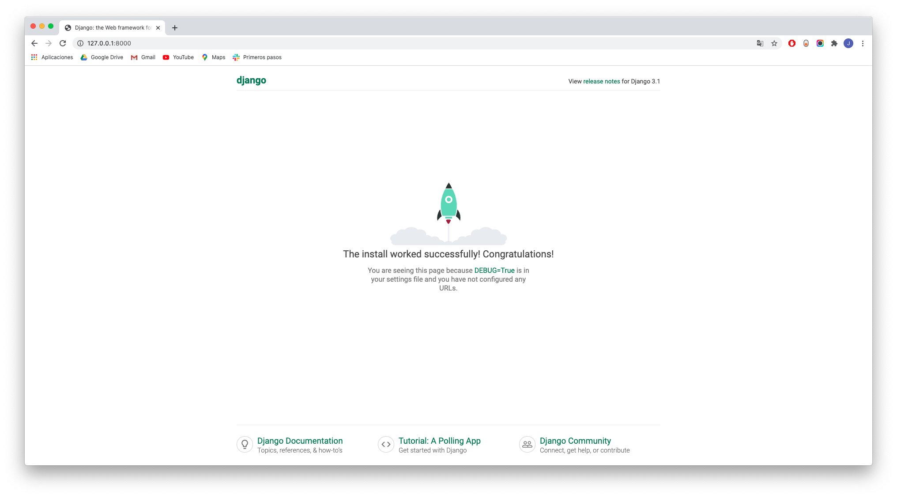
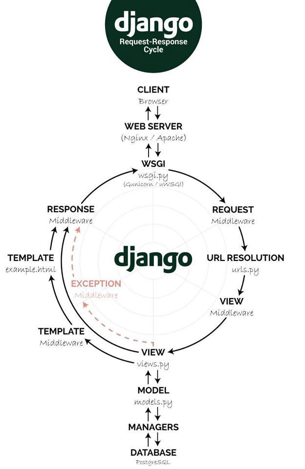
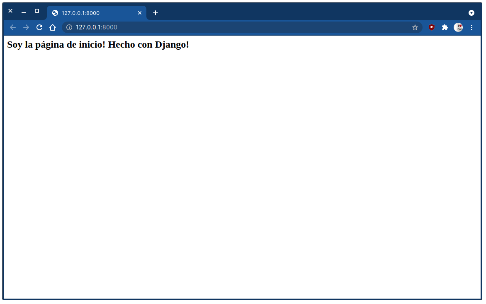

[`Backend con Python`](../../Readme.md) > [`Sesión 01`](../Readme.md) > Ejemplo-02
## Iniciar la construcción de una aplicación web con Django

### OBJETIVOS
- Conocer como iniciar un proyecto en Django
- Conocer como crear una aplicación
- Conocer y definir una ruta en Django
- Conocer y definir una vista asociada a la ruta

#### REQUISITOS
1. Actualizar repositorio
1. Usar la carpeta de trabajo `Sesion-01/Ejemplo-02`

#### DESARROLLO
1. Crear y activar el entorno virtual __banco.com__:

```sh
$ conda create -n banco.com python=3
...
$ conda activate banco.com

(banco.com) $ 
```

1. Instalar Django:

```sh
(banco.com) $ pip install django
...
(banco.com) $ 

```

1. Crear el proyecto __banco_project__ con Django:

```sh
(banco.com) $ django-admin startproject banco_project
(banco.com) $ tree banco_project/
banco_project/
├── banco_project
│   ├── asgi.py
│   ├── __init__.py
│   ├── settings.py
│   ├── urls.py
│   └── wsgi.py
└── manage.py
```

2. Ingresamos al directorio y crear la aplicación __banco_app__:

```sh
(banco.com) $ cd banco_project/
(banco.com) banco_project $ python manage.py startapp banco_app
(banco.com) banco_project $ tree
.
├── banco_app
│   ├── admin.py
│   ├── apps.py
│   ├── __init__.py
│   ├── migrations
│   │   └── __init__.py
│   ├── models.py
│   ├── tests.py
│   └── views.py
├── banco_project
│   ├── asgi.py
│   ├── __init__.py
│   ├── __pycache__
│   │   ├── __init__.cpython-310.pyc
│   │   └── settings.cpython-310.pyc
│   ├── settings.py
│   ├── urls.py
│   └── wsgi.py
└── manage.py
```

4. Ejecutar el proyecto __banco__ para desarrollo:

```sh
(banco.com) $ python3 manage.py runserver
Watching for file changes with StatReloader
Performing system checks...

System check identified no issues (0 silenced).

You have 18 unapplied migration(s). Your project may not work properly until you apply the migrations for app(s): admin, auth, contenttypes, sessions.
Run 'python manage.py migrate' to apply them.
May 28, 2022 - 08:29:53
Django version 4.0.4, using settings 'banco_project.settings'
Starting development server at http://127.0.0.1:8000/
Quit the server with CONTROL-C.
```
   
Si se abre la url indicada (http://127.0.0.1:8000/), se observará el equivalente al "hola mundo!" pero de Django:



así que sigamos un poco más adelante, nuestro objetivo es mostrar la página `index.html` pero como parte de la aplicación web.
   
__Nota:__ Como el servidor bloquea la terminal, vamos a dejar esta terminal aquí y para los siguiente comandos abrir otra terminal, activar el entorno virtual `banco.com`.
   
```sh
(base) $ conda activate banco.com
(banco.com) $
```

5. Agrega la aplicación __banco_app__ a la configuración en el archivo `banco_project/banco_project/settings.py`:

```python
# Application definition

INSTALLED_APPS = [
   'django.contrib.admin',
   'django.contrib.auth',
   'django.contrib.contenttypes',
   'django.contrib.sessions',
   'django.contrib.messages',
   'django.contrib.staticfiles',
   'banco_app',
]   
```
   
__Flujo de una petición y su respuesta a traves de los componentes de Django__



6. Agrega información regional a la configuración en el archivo `banco_project/banco_project/settings.py`:

```python
# Internationalization
# https://docs.djangoproject.com/en/2.2/topics/i18n/

LANGUAGE_CODE = 'es-MX'

TIME_ZONE = 'America/Mexico_City'
```
   
Esto permite que el administrador de django esté en español, además de que el tratamiento de horas y fechas serán referidas a la zona horaria de la Ciudad de México.

7. Ahora si vamos a agregar nuestra página __Inicio__ a nuestro proyecto lo que implica realizar las siguientes acciones:

   1. Asociar todas las rutas o urls definidas por el proyecto __banco_project__ a las rutas definidas por la aplicación __banco_app__.
   2. Agregar la ruta o url `/` y asociarla con una vista para indicar a Django que la página de inicio existe y las peticiones serán atendidas por la vista (o función) asociada.
   3. Crear la función o vista definida en el paso 1
   4. Opcionalmente asociar una plantilla html o en su caso generar el código html que se utilizará por la página de inicio.

Entonces comenzamos, vamos a redirigir todas las rutas que no sean `/admin/` a las rutas de la aplicación __banco_app__ ya que es nuestra aplicación principal.

```
url / -> banco_project/banco_project/urls.py -> banco_project/banco_app/urls.py
```

__En el archivo `banco_project/banco_app/urls.py` agregar lo siguiente:__

```python
from django.contrib import admin
from django.urls import path, include  # modificada

urlpatterns = [
   path('', include("banco_app.urls")),  # agregada
   path('admin/', admin.site.urls),
]
```
   
En la vetana donde se está ejecutando el proyecto __banco_project__ se puede observar el siguiente mensaje de error:

```sh
...
  File "<frozen importlib._bootstrap>", line 1030, in _gcd_import
  File "<frozen importlib._bootstrap>", line 1007, in _find_and_load
  File "<frozen importlib._bootstrap>", line 972, in _find_and_load_unlocked
  File "<frozen importlib._bootstrap>", line 228, in _call_with_frames_removed
  File "<frozen importlib._bootstrap>", line 1030, in _gcd_import
  File "<frozen importlib._bootstrap>", line 1007, in _find_and_load
  File "<frozen importlib._bootstrap>", line 984, in _find_and_load_unlocked
ModuleNotFoundError: No module named 'banco_app.urls'
```

Lo que indica que nos falta crear el archivo `urls.py` dentro de la carpeta `banco_project/banco_app/`

__Crear el archivo `banco_project/banco_app/urls.py` con el siguiente contenido:__
   
```python
from django.urls import path
from . import views

urlpatterns = [
    path('', views.index, name="index"),
]
```
   
__Reiniciar Django para observar el resultado:__

```sh
...
File "<frozen importlib._bootstrap>", line 1030, in _gcd_import
  File "<frozen importlib._bootstrap>", line 1007, in _find_and_load
  File "<frozen importlib._bootstrap>", line 972, in _find_and_load_unlocked
  File "<frozen importlib._bootstrap>", line 228, in _call_with_frames_removed
  File "<frozen importlib._bootstrap>", line 1030, in _gcd_import
  File "<frozen importlib._bootstrap>", line 1007, in _find_and_load
  File "<frozen importlib._bootstrap>", line 986, in _find_and_load_unlocked
  File "<frozen importlib._bootstrap>", line 680, in _load_unlocked
  File "<frozen importlib._bootstrap_external>", line 850, in exec_module
  File "<frozen importlib._bootstrap>", line 228, in _call_with_frames_removed
  File "/home/rctorr/banco_project/banco_app/urls.py", line 5, in <module>
    path('', views.index, name="index"),
AttributeError: module 'banco_app.views' has no attribute 'index'
```

Lo que indica que en el archivo `banco_project/banco_app/views.py` no existe una función llamada `index()`, así que toca agregar dicha función.

```
url / -> banco_project/banco_app/urls.py -> banco_project/banco_app/views.py:index()
```

9. Agregar la función/vista `index()` al archivo `banco_project/banco_app/views.py` con el siguiente contenido:

```python
from django.http import HttpResponse
from django.shortcuts import render

def index(request):
   """ Vista para atender la petición de la url GET / """
   return HttpResponse("<h2>Soy la página de inicio! Hecho con Django!</h2>")
```

__Nota: Si la aplicación Django no muestra el link para abrir la aplicación, entonces reiniciar Django__

__El resultado debería ser el siguiente:__


***
