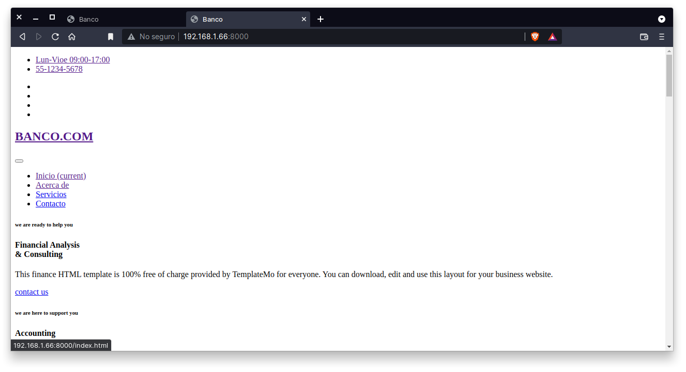

`Fullstack con Python` > [`Backend con Python`](../../Readme.md) > [`Sesión 01`](../Readme.md) > Ejemplo-03
## Agregar la página de inicio ya maquetada a la aplicación web

### OBJETIVOS
- Conocer como agregar páginas ya maquetadas por medio de las plantillas con Django.
- Conocer como configurar y agregar los archivos estáticos en una aplicación web con Django.
- Contar con la página de inicio del proyecto Banco disponible con Django.

#### REQUISITOS
1. Actualizar repositorio
1. Activar el entorno virtual __banco.com__
1. Página de inicio maquetada del proyecto __Banco__

   

#### DESARROLLO
1. Ejecutar el proyecto __banco_project__ con:

```sh
(base) $ conda activate banco.com
(banco.com) $ cd Escritorio/banco_project
(banco.com) banco_project $ python manage.py runserver
...
```

1. Haciendo uso del sistema de plantillas de Django, integrar la página de inicio maquetada que se encuentra en `banco.com/public_html/index.html`.

__Crear las carpetas `banco_prject/banco_app/templates/banco_app` para almacenar las plantillas o documentos html para la aplicación `banco_app`:__

```sh
(banco.com) banco_project $ mkdir -p banco_app/templates/banco_app
```

__Copiar el archivo `banco.com/public_html/index.html` dentro de la carpeta `banco_project/banco_app/templates/banco_app/`:__

```sh
(base) $ cp ...banco.com/public_html/index.html banco_project/banco_app/templates/banco_app
```

__Modificar la función `index()` en el archivo `banco_app/views.py` para hacer uso de las plantillas (templates)__

```python
from django.shortcuts import render

# Create your views here.
def index(request):
   """ Vista para atender la petición de la url / """
   return render(request, "banco_app/index.html")
```

Por omisión, Django busca los archivos html en la carpeta `proyecto/aplicacion/templates/aplicacion/`

__El resultado en el navegador debería de ser el siguiente:__



Hasta aquí ya podemos ver el html, pero ¿y los estilos y las imágenes?

Como son archivos estáticos aún no hemos autorizado a que se puedan ver, así que continuemos.
***

1. Agregando acceso a los archivos estáticos (ruta y vista)

__Crear la carpeta `banco_project/banco_app/static/banco_app/`:__

```sh
(base) $ mkdir -p banco_app/static/banco_app
```

__Copiar las carpetas de los archivos estáticos (bootstrap, css, fonts, images, jquery y js):__

```sh
(base) $ cp -av public_html/bootstrap public_html/css public_html/fonts public_html/images public_html/jquery public_html/js Banco/banco_app/static/banco_app/

(base) $ tree banco_app/static/
banco_app/static/
└── banco_app
    ├── bootstrap
    ├── css
    ├── fonts
    ├── images
    ├── jquery
    └── js
```

__Finalmente hay que modificar la ruta en el archivo `index.html` para que usen el sistema de Django__

Primero cargamos el sistema que nos ayuda a mejar los archivos estáticos con:

```

```

Y ahora todas las url relativas o absolutas ahora tienen que ser de la forma  ``, un ejemplos se muestra a continuación:

```html
<link href="" rel="stylesheet">
```
Remplazar todas las coincidencias.

__Actualizar el navegador y entonces se debería de ver la página mostrada al inicio__

**Nota:** Si no funciona realizar lo siguiente:
- Recargar la página forzado actualizar el cache del navegador con `Control+Shift+R`.
- En la ventana donde se está ejecutando el proyecto, deterlo y volver a iniciarlo.
- Usar una ventana de incógnito.
- Pedir ayuda a un experto (que no lo vas a encontrar en clase!)

Si si funciona entonces:
- Misión cumplida!
