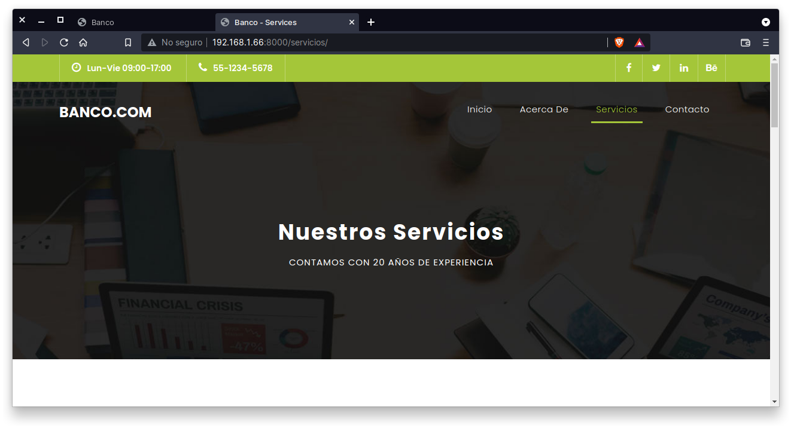

[`Backend con Python`](../../Readme.md) > [`Sesión 01`](../Readme.md) > Reto-03
## Agregar una página usando el sistema de plantillas de Django

### OBJETIVOS
- Agregar una página en base a una página maketada previamente
- Modificar las urls necesarias para hacer visible la página de forma correcta

#### REQUISITOS
1. Actualizar repositorio
1. Usar la carpeta de trabajo `Sesion-01/Reto-03`
1. Activar el entorno virtual __Banco__

#### DESARROLLO
1. Modificar la página de servicios para se muestre la página siguiente haciendo uso del archivo `servicios.html`.

  
   ***
