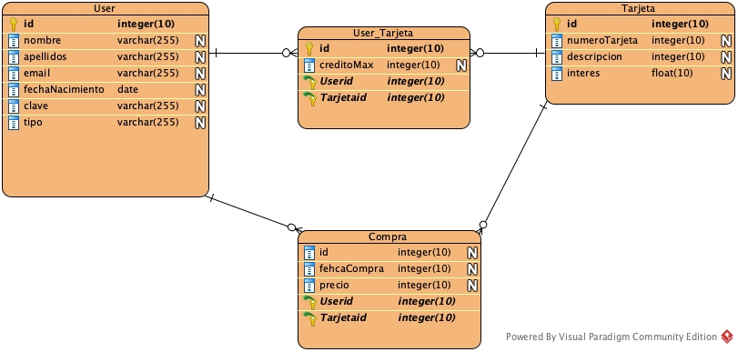

[`Backend con Python`](../../Readme.md) > [`Sesión 03`](../Readme.md) > 
## Creando una tabla con el modelo de datos de Django

### OBJETIVO
- Conocer y crear el modelo de datos con Django.
- Conocer el sistema de bases de datos usado por Django.
- Configurando Django para manejar datos regionales.
- Agregando el modelo al administrador de Django

#### REQUISITOS
1. Actualizar repositorio
1. Usar la carpeta de trabajo `Sesion-03/`
1. Diagrama del modelo entidad-relación para el proyecto __Banco__

   

1. Documentación de Django referente a modelos:
   - Descripción de modelos y ejemplos: https://docs.djangoproject.com/en/4.0/topics/db/models/
   - Referencia a la API de Modelos en Django https://docs.djangoproject.com/en/4.0/ref/models/
   - Referencia a los tipos de datos que maneja Django https://docs.djangoproject.com/en/4.0/ref/models/fields/#field-types

#### DESARROLLO
1. Usando el modelo entidad-relación, crear cada modelo correspondiente a cada tabla.

   __Creando el modelo para la tabla Cliente relacionándola con la tabla User de Django agregando lo siguiente al archivo `banco_project/banco_app/models.py`:__

   ```python
   from django.db import models
   from django.contrib.auth.models import User

   # Create your models here.
   class Cliente(models.Model):
       """ Define la tabla Perfil """
       fechaNacimiento = models.DateField(null=True, blank=True)
       GENERO = [
           ("H", "Hombre"),
           ("M", "Mujer"),
           ("O", "Otro"),
       ]
       genero = models.CharField(max_length=1, choices=GENERO)
       TIPO = [
           ("PF", "Persona Física"),
           ("PM", "Persona Moral"),
       ]
       tipo = models.CharField(max_length=45, choices=TIPO, null=True, blank=True)
   ```
   
   Observar como se han remplazado los tipos de datos de SQL por tipos de datos de Django, además, cada campo definido es requerido a menos que se indique lo contrario, que es el caso de los campos con los parámetros `null=True` y `blank=True` que son opcionales.

   También está el caso del campo __genero__ que sólo puede tomar las opciones indicadas por el atributo `choices=GENERO` y que puede ser empleado para cuando las opciones no cambiarán en toda la vida de la aplicación.

   __Nota:__ Django por omisión usa la base de datos SQLite3 y crea un archivo en la carpeta del proyecto con el nombre `db.sqlite3`.

   __Avisando a Django que hemos modificado el archivo `models.py`:__

   ```console
   (banco.com) banco_project $ python manage.py makemigrations
   Migrations for 'banco_app':
     banco_app/migrations/0001_initial.py
       - Create model Cliente

   (banco.com) banco_project $ python manage.py migrate
   Operations to perform:
     Apply all migrations: admin, auth, banco_app, contenttypes, sessions
   Running migrations:
     Applying contenttypes.0001_initial... OK
     Applying auth.0001_initial... OK
     Applying admin.0001_initial... OK
     Applying admin.0002_logentry_remove_auto_add... OK
     Applying admin.0003_logentry_add_action_flag_choices... OK
     Applying contenttypes.0002_remove_content_type_name... OK
     Applying auth.0002_alter_permission_name_max_length... OK
     Applying auth.0003_alter_user_email_max_length... OK
     Applying auth.0004_alter_user_username_opts... OK
     Applying auth.0005_alter_user_last_login_null... OK
     Applying auth.0006_require_contenttypes_0002... OK
     Applying auth.0007_alter_validators_add_error_messages... OK
     Applying auth.0008_alter_user_username_max_length... OK
     Applying auth.0009_alter_user_last_name_max_length... OK
     Applying auth.0010_alter_group_name_max_length... OK
     Applying auth.0011_update_proxy_permissions... OK
     Applying banco_app.0001_initial... OK
     Applying sessions.0001_initial... OK

   (banco.com) /banco_project $
   ```

   __Django ya cuenta con un sistema CRUD para nuestros modelos y para activarlo es necesario agregar un usuario administrador cuando menos:__

   ```console
   (banco.com) banco_project $ python manage.py createsuperuser
   Nombre de usuario (leave blank to use 'rctorr'): banco_project
   Dirección de correo electrónico: banco_project@gmail.com
   Password:
   Password (again):
   La contraseña es muy similar a  nombre de usuario.
   Bypass password validation and create user anyway? [y/N]: y
   Superuser created successfully.

   (banco.com) banco_project $
   ```

   Abrir la url http://localhost:8000/admin y usar los siguientes datos para entrar:
   - User: banco_project
   - Clave: banco_project

   __Se deberá de ver algo similar a la siguiente imagen:__

   

   Pero nuestro modelo User ¿dónde está?

   __Agregando el siguiente código al archivo `banco_project/banco_app/admin.py`:__

   ```python
   from django.contrib import admin
   from .models import Cliente

   # Register your models here.
   admin.site.register(Cliente)
   ```
   Actuaizamos el navegador se obtendrá lo siguiente:

   

   Ahora ya se puede listar, agregar, actualizar o eliminar registros en la tabla Cliente, así se verías después de agregar tres usuarios a nuestro modelo Cliente.

   

   Diviértete!!!
